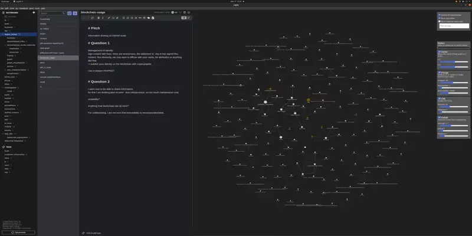

# Joplin Graph Plugin

This joplin plugin turns notes into nodes in a knowledge graph.

Links are built from tags and from cross-links between notes.

* The visualization can scale reasonably well to display up to several thousand nodes 
and links at the same time.
* Nodes and links can be filtered dynamically to explore data.
* The graph layout can be customized dynamically to help navigate large graphs.
* Support multiple links between notes.

***

## Controls

`CTRL+click` or `META+click` on a node opens the related note in the editor.

`SHIFT+click` for multiple node selection.

### Layout options

The layout is based on as set of d3 forces that can be enabled/disabled.
Many options are supported in order to tune the layout depending on the specific data.

### Filters

Filters are essential to remove noise and for performance reasons.

Several filters are implemented and can be composed as conjunct terms (AND).

* view can be focused on selected nodes.
* tags can be filtered and several tags can be selected as disjoint filtering terms (OR).
* nodes representing tags can be displayed or not.
* multiple relationships between two nodes can be aggregated as one.

### Settings

plugin settings help tune the graph rendering.

In particular, simulation settings COOLDOWN_TIME, COOLDOWN_TICKS & WARMUP_TICKS can help rendering larger graphs.

Label size are also customizable.

***

## Similar projects and related plugins

This plugin works best in combination with other plugins that helps manage links and backlinks, provide links preview
or facilate creating notes from existing notes.

* [Note Link System](https://discourse.joplinapp.org/t/plugin-note-link-system/21768)
* [Quick Links](https://discourse.joplinapp.org/t/quick-links-plugin/14214)
* [Copy Markdown Link](https://discourse.joplinapp.org/t/copy-markdown-link-to-active-note/1440)
* [Copy Note from Selection](https://discourse.joplinapp.org/t/create-note-from-highlighted-text/12511)
* [Automatic Backlinks](https://discourse.joplinapp.org/t/automatic-backlinks-with-manual-insert-option/13632)

The graph interactions have been inspired by the foam vscode extension : `https://foambubble.github.io/foam/`.

You may also want to look at another graph plugin for Joplin `https://github.com/treymo/joplin-link-graph` which
also provide graph visualization.

***

## Development

### Project Structure

`src/core` a generic graph model

`src/joplin` joplin specific code

`src/common` definitions shared by the `core` and `joplin` component

`src/ui` ui components

`index.ts` plugin bootstrap
  

### Building the plugin

The plugin is built using Webpack, which creates the compiled code in `/dist`. A JPL archive will also be created at the root, which can use to distribute the plugin.
To build the plugin, simply run `npm run dist`.

### Development workflow

`npm run test` can be used to generate sourceMaps useful for debugging.

`npm run test-ui` will pop up the ui in the browser using webpack dev-server which is useful when working on the ui instead of rebuilding the plugin each time.
Note that this requires `webpack-cli@4` while building for joplin requires `webpack-cli@3`.

So for now we need to get back and forth : `npm install webpack-cli@4` or `npm install webpack-cli@3` when developing the ui and testing integration.

`npm run test` will run a jest test suite.

### Dependencies

This project is written Typescript and React.
Main dependencies:

* d3: `https://github.com/d3/d3`
* d3 library: `https://github.com/vasturiano/force-graph`.
* react component for tag selection: `https://github.com/react-tags/react-tags`

The layout controls have been adapted from :
`https://bl.ocks.org/steveharoz/8c3e2524079a8c440df60c1ab72b5d03`

### Updating the plugin framework

To update the plugin framework, run `npm run update`.

A few changes have been made to the stock `webpack.config.js` so caution is required when trying to update the plugin framework.

***

## Notes

### Plugin/UI Communication

Short of a mechanism for a two-way async communication between the ui and the plugin,
plugin events are recorded in a queue.

Whenever the ui is ready to process a new events, it notifies the plugin, which will 
poll events from the queues at the rate of a consumption of the ui until the queue is empty.

### Style

This plugin is not yet adapting to Joplin Themes. Dark Themes work best.

***

## Licensing

MIT License.

